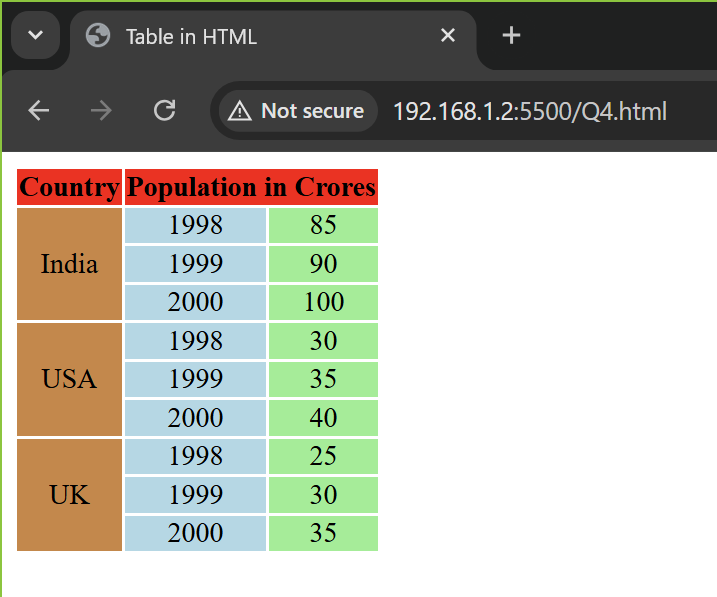

# 220962063 - Sambhav Nath Jain
Home Assignment - WEEK 1
<br>
Date: 8 January 2025 
<br>
Time: 7:35PM

<b>Question 4: Using HTML, make the given table.</b>

```html
<!DOCTYPE html>
<html>
    <title>
        Table in HTML
    </title>

    <body>
        <table>
            <tr>
                <th style="background-color: red;">Country</th>
                <th colspan="2" style="background-color: red; text-align: center;" >Population in Crores</th>
            </tr>
            <tr>
                <td rowspan="3" style="background-color: peru; text-align-last: center;">India</td>
                <td style="background-color: lightblue; text-align-last: center;">1998</td>
                <td style="background-color: lightgreen; text-align-last: center;">85</td>
            </tr>
            <tr>
                <td style="background-color: lightblue; text-align-last: center;">1999</td>
                <td style="background-color: lightgreen; text-align-last: center;">90</td>
            </tr>
            <tr>
                <td style="background-color: lightblue; text-align-last: center;">2000</td>
                <td style="background-color: lightgreen; text-align-last: center;">100</td>
            </tr>
            <tr>
                <td rowspan="3" style="background-color: peru; text-align-last: center;">USA</td>
                <td style="background-color: lightblue; text-align-last: center;">1998</td>
                <td style="background-color: lightgreen; text-align-last: center;">30</td>
            </tr>
            <tr>
                <td style="background-color: lightblue; text-align-last: center;">1999</td>
                <td style="background-color: lightgreen; text-align-last: center;">35</td>
            </tr>
            <tr>
                <td style="background-color: lightblue; text-align-last: center;">2000</td>
                <td style="background-color: lightgreen; text-align-last: center;">40</td>
            </tr>
            <tr>
                <td rowspan="3" style="background-color: peru; text-align-last: center;">UK</td>
                <td style="background-color: lightblue; text-align-last: center;">1998</td>
                <td style="background-color: lightgreen; text-align-last: center;">25</td>
            </tr>
            <tr>
                <td style="background-color: lightblue; text-align-last: center;">1999</td>
                <td style="background-color: lightgreen; text-align-last: center;">30</td>
            </tr>
            <tr>
                <td style="background-color: lightblue; text-align-last: center;">2000</td>
                <td style="background-color: lightgreen; text-align-last: center;">35</td>
            </tr>
        </table>
    </body>
</html>
```

