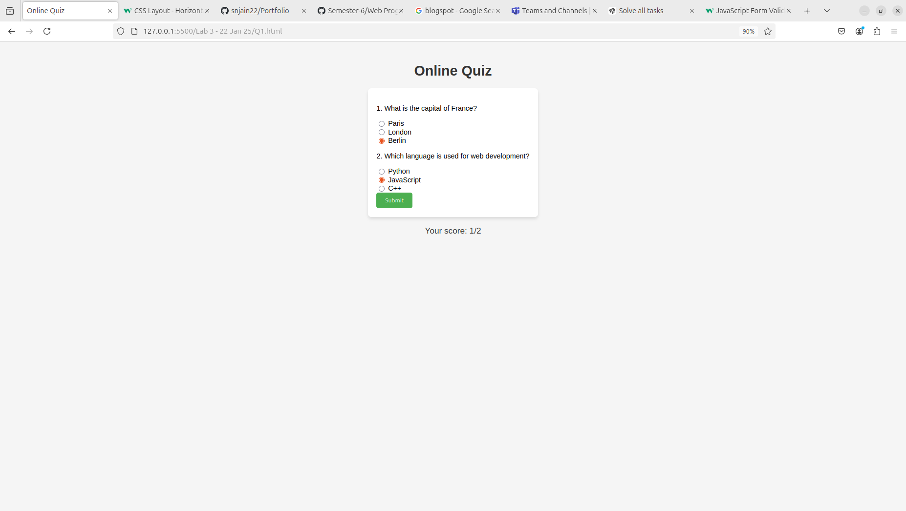
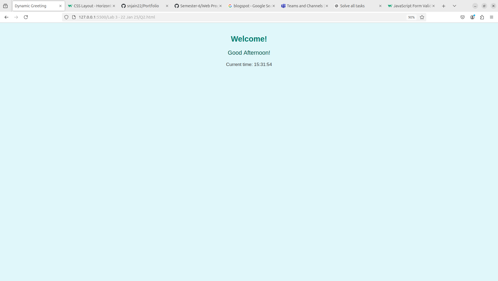
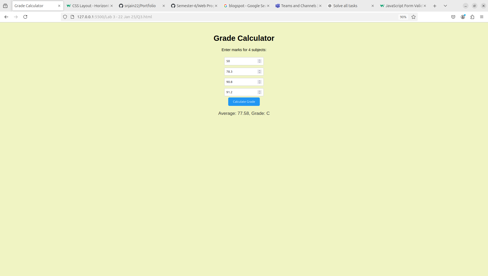
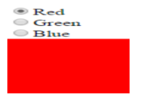
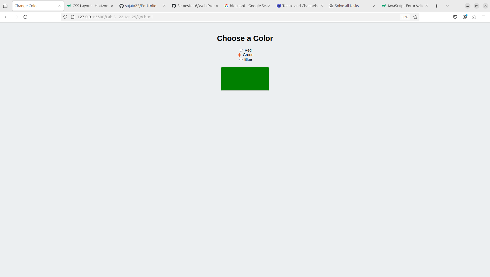

# 220962063 - Sambhav Nath Jain
LAB 3 
<br>
Date: 22 January 2025 
<br>
Time: 3:30PM

> Q1. Online Quiz
```html
<!DOCTYPE html>
<html lang="en">
<head>
    <meta charset="UTF-8">
    <meta name="viewport" content="width=device-width, initial-scale=1.0">
    <title>Online Quiz</title>
    <style>
        body {
            font-family: Arial, sans-serif;
            text-align: center;
            padding: 20px;
            background-color: #f5f5f5;
        }
        h1 {
            color: #333;
        }
        form {
            display: inline-block;
            text-align: left;
            background-color: #fff;
            padding: 20px;
            border-radius: 8px;
            box-shadow: 0 4px 6px rgba(0, 0, 0, 0.1);
        }
        button {
            background-color: #4caf50;
            color: white;
            padding: 10px 20px;
            border: none;
            border-radius: 5px;
            cursor: pointer;
        }
        button:hover {
            background-color: #45a049;
        }
        #result {
            margin-top: 20px;
            font-size: 1.2em;
            color: #333;
        }
    </style>
</head>
<body>
    <h1>Online Quiz</h1>
    <form id="quizForm">
        <p>1. What is the capital of France?</p>
        <input type="radio" name="q1" value="Paris"> Paris<br>
        <input type="radio" name="q1" value="London"> London<br>
        <input type="radio" name="q1" value="Berlin"> Berlin<br>
        <p>2. Which language is used for web development?</p>
        <input type="radio" name="q2" value="Python"> Python<br>
        <input type="radio" name="q2" value="JavaScript"> JavaScript<br>
        <input type="radio" name="q2" value="C++"> C++<br>
        <button type="button" onclick="submitQuiz()">Submit</button>
    </form>
    <p id="result"></p>

    <script>
        function submitQuiz() {
            const answers = {
                q1: "Paris",
                q2: "JavaScript"
            };
            let score = 0;
            const form = document.getElementById("quizForm");
            for (let key in answers) {
                const selected = form[key].value;
                if (selected === answers[key]) {
                    score++;
                }
            }
            document.getElementById("result").innerText = `Your score: ${score}/${Object.keys(answers).length}`;
        }
    </script>
</body>
</html>
    
```



> Q2. Write a JavaScript program to Wish a user at different hours of a day. Use
appropriate dialog boxes for wishing the user. Display the dynamic clock on the
web page. Make use of CSS and HTML5 elements for creative and attractive
design.

```html
<!DOCTYPE html>
<html lang="en">
<head>
    <meta charset="UTF-8">
    <meta name="viewport" content="width=device-width, initial-scale=1.0">
    <title>Dynamic Greeting</title>
    <style>
        body {
            font-family: Arial, sans-serif;
            text-align: center;
            padding: 20px;
            background-color: #e0f7fa;
        }
        h1 {
            color: #00796b;
        }
        #greeting {
            font-size: 1.5em;
            color: #004d40;
        }
        #clock {
            font-size: 1.2em;
            color: #333;
            margin-top: 20px;
        }
    </style>
</head>
<body>
    <h1>Welcome!</h1>
    <p id="greeting"></p>
    <p id="clock"></p>

    <script>
        function updateClock() {
            const now = new Date();
            const hours = now.getHours();
            const minutes = now.getMinutes().toString().padStart(2, "0");
            const seconds = now.getSeconds().toString().padStart(2, "0");

            const timeString = `${hours}:${minutes}:${seconds}`;
            document.getElementById("clock").innerText = `Current time: ${timeString}`;

            let greeting;
            if (hours < 12) {
                greeting = "Good Morning!";
            } else if (hours < 18) {
                greeting = "Good Afternoon!";
            } else {
                greeting = "Good Evening!";
            }
            document.getElementById("greeting").innerText = greeting;
        }

        setInterval(updateClock, 1000);
        updateClock(); // Initialize immediately
    </script>
</body>
</html>
```


> Q3. Write the java script program to display the grade [A, B,C,D] based on the marks
entered by student(take the input into text boxes). Enter the marks of 4 subjects and
calculate the average( using button). If the avg>90 then A, avg>80 then B, if avg>70
then C, if avg>60 then D.

```html
<!DOCTYPE html>
<html lang="en">
<head>
    <meta charset="UTF-8">
    <meta name="viewport" content="width=device-width, initial-scale=1.0">
    <title>Grade Calculator</title>
    <style>
        body {
            font-family: Arial, sans-serif;
            text-align: center;
            padding: 20px;
            background-color: #f0f4c3;
        }
        input {
            margin: 5px;
            padding: 8px;
            width: 150px;
            border: 1px solid #ccc;
            border-radius: 4px;
        }
        button {
            background-color: #2196f3;
            color: white;
            padding: 10px 20px;
            border: none;
            border-radius: 5px;
            cursor: pointer;
        }
        button:hover {
            background-color: #1976d2;
        }
        #result {
            margin-top: 20px;
            font-size: 1.2em;
            color: #333;
        }
    </style>
</head>
<body>
    <h1>Grade Calculator</h1>
    <p>Enter marks for 4 subjects:</p>
    <input type="number" id="mark1" placeholder="Subject 1"><br>
    <input type="number" id="mark2" placeholder="Subject 2"><br>
    <input type="number" id="mark3" placeholder="Subject 3"><br>
    <input type="number" id="mark4" placeholder="Subject 4"><br>
    <button onclick="calculateGrade()">Calculate Grade</button>
    <p id="result"></p>

    <script>
        function calculateGrade() {
            const marks = [
                parseFloat(document.getElementById("mark1").value),
                parseFloat(document.getElementById("mark2").value),
                parseFloat(document.getElementById("mark3").value),
                parseFloat(document.getElementById("mark4").value)
            ];
            const average = marks.reduce((a, b) => a + b, 0) / marks.length;

            let grade;
            if (average > 90) {
                grade = "A";
            } else if (average > 80) {
                grade = "B";
            } else if (average > 70) {
                grade = "C";
            } else if (average > 60) {
                grade = "D";
            } else {
                grade = "F";
            }

            document.getElementById("result").innerText = `Average: ${average.toFixed(2)}, Grade: ${grade}`;
        }
    </script>
</body>
</html>

```


> Q4. Write the JavaScript program to show the below output.

```html 
<!DOCTYPE html>
<html lang="en">
<head>
    <meta charset="UTF-8">
    <meta name="viewport" content="width=device-width, initial-scale=1.0">
    <title>Change Color</title>
    <style>
        body {
            font-family: Arial, sans-serif;
            text-align: center;
            padding: 20px;
            background-color: #eceff1;
        }
        form {
            margin-bottom: 20px;
        }
        .color-box {
            width: 200px;
            height: 100px;
            margin: 0 auto;
            border: 2px solid #ccc;
            border-radius: 5px;
        }
    </style>
</head>
<body>
    <h1>Choose a Color</h1>
    <form>
        <input type="radio" name="color" value="red" onclick="changeColor('red')" checked> Red<br>
        <input type="radio" name="color" value="green" onclick="changeColor('green')"> Green<br>
        <input type="radio" name="color" value="blue" onclick="changeColor('blue')"> Blue<br>
    </form>
    <div id="colorBox" class="color-box" style="background-color: red;"></div>

    <script>
        function changeColor(color) {
            document.getElementById('colorBox').style.backgroundColor = color;
        }
    </script>
</body>
</html>
```
